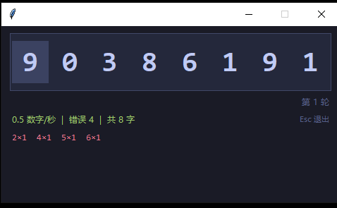

# 小键盘数字盲打练习

一款轻量级的小键盘（Numpad）数字盲打训练工具，由 [opencode](https://opencode.ai) AI 助手协助开发完成。

## 功能特点

- **8位随机数字**：每轮随机生成8个0-9数字，打完自动进入下一轮
- **正确反馈**：输入正确时数字变橙色，每个数字对应不同音高的计算器风格提示音（500-950Hz）
- **错误反馈**：输入错误时弹跳动画 + 低沉提示音，必须打对才能继续
- **实时统计**：底部显示打字速度（数字/秒）、错误总数、累计输入字数
- **逐位错误追踪**：显示每个数字（0-9）各自的错误次数，针对性改进
- **窗口位置记忆**：下次打开自动恢复到上次的窗口位置
- **Esc快速退出**：按 Esc 键直接关闭
- **深色主题**：Catppuccin Mocha 配色，护眼舒适

## 使用方法

### 方式一：直接运行 exe（推荐）

下载 `小键盘数字盲打练习.exe`，双击即可运行，无需安装 Python。

> 注意：请确保 NumLock 已开启，使用小键盘区域输入数字。

### 方式二：运行 Python 脚本

需要 Python 3.x（自带 tkinter），运行：

```
python numpad_practice.py
```

自行打包 exe：

```
pip install pyinstaller
pyinstaller --onefile --windowed --name "小键盘数字盲打练习" numpad_practice.py
```

## 界面预览



## 技术栈

- Python 3 + tkinter（标准库，零依赖）
- winsound（系统蜂鸣器音效）

## 文件说明

| 文件 | 说明 |
|------|------|
| `numpad_practice.py` | Python 源码 |
| `小键盘数字盲打练习.exe` | Windows 可执行文件（免安装） |

## 许可

MIT License
